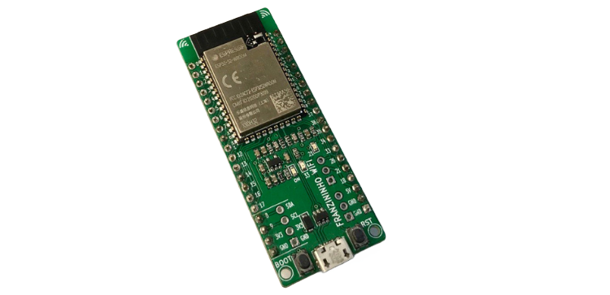

================
Franzininho WiFi
================

`Franzininho WiFi <https://docs.franzininho.com.br/docs/>`_
is an education development board based on ESP32-S2 which is a
highly integraed, low-power, single-core and rich set of IO capabilities.
The main propouse is bring to eletronics projects more accessible 
for makers, enthusiast and professional development.     

    Franzininho WiFi

.. note::
  Franzininho WiFi does not have USB TTL Convert on board, therefore 
  should be use external convert, while USB CDC is not implemented.

Features
========

  - ESP32-S2-WROVER
    - 4 MB external SPI flash
  - USB OTG 1.1
  - SPI
  - I2S
  - I2C 
  - Power LED
  - RST and BOOT buttons

Buttons and LEDs
================

Buttons
-------

There are two buttons labeled BOOT and RST.  The RST button is not available
to the software.  It pulls the chip enable line that doubles as a reset line.

The BOOT button is connected to IO0.  On reset, it is used as a strapping
pin to determine whether the chip boots normally or into the serial
bootloader.

LEDs
----

There are three on-board LEDs. GREEN_LED indicates
power on, YELLOW_LED (GPIO 33) and BLUE_LED(GPIO 21) is for general purpose.

Configurations
==============

nsh
---

Basic NuttShell configuration (console enabled in UART0 connected in external USB convert at 115200 bps).
